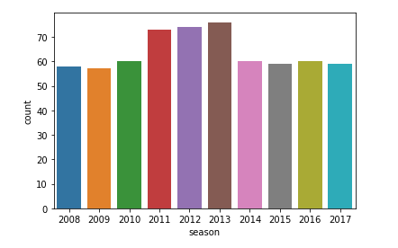
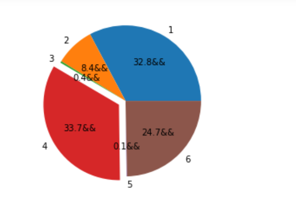

# IPL_DataAnalysis

## Team Data Analysis using a Dataset

* Total wins by teams in all seasons

* Graph showing teams selecting fielding or batting in all seasons

* Graph telling total matches played in different years

* Showing Mumbai Indians wins in all seasons 

## Player Data Analysis

* Piechart showing runs by 4,6 etc by player 

* Piechart showing type of dismissals of Rohit Sharma

